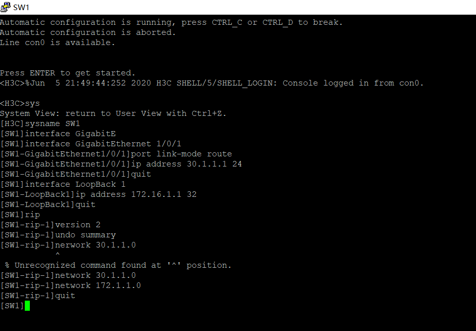

实现RT1和RT3的两个环回路lo0互相之间可以通信

<!--more-->

实现SW1和SW3的两个环回路lo0互相之间可以通信

注意sw1时network那里错了,应该是172.16.1.1

然后，port的时候还应该有其他信息，没有信息，应该重启一下交换机，因为后来改了的时候没有截图，命令都差不多就放这些图片了。

参考链接：

<https://www.xiaoheidiannao.com/HCL-Switch-RIP-Configuration.html>

<https://www.xiaoheidiannao.com/HCL-Router-OSPF-Configuration.html>