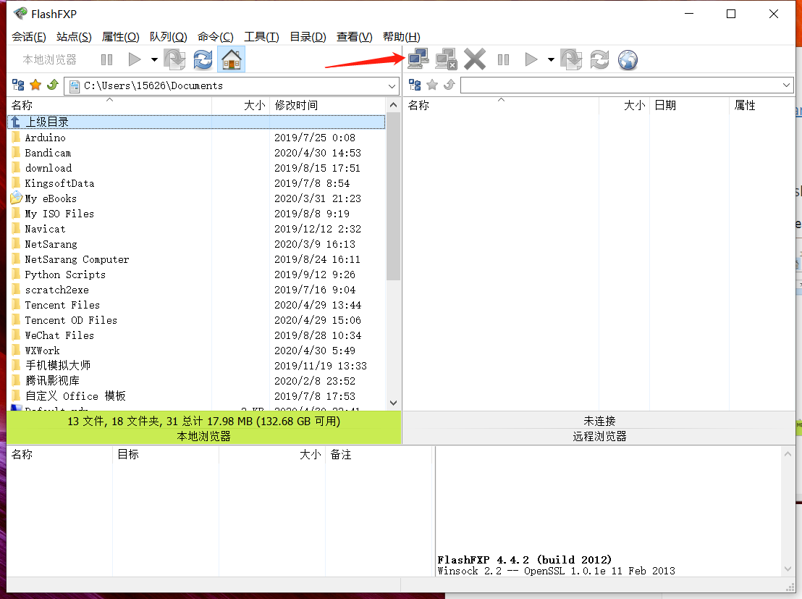
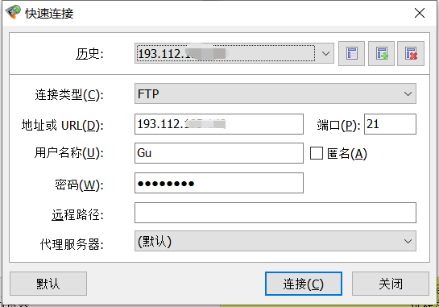
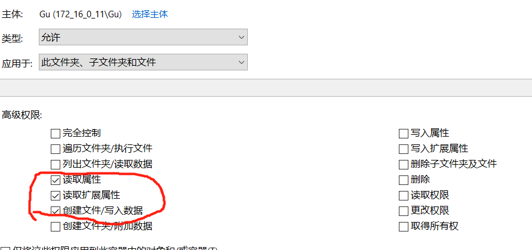

## 1 用flashfxp连接ftp服务器与传输文件

破解版下载地址：

链接：https://pan.baidu.com/s/1zY8vnCJvPBFycvZwV1L-pA 
提取码：kvhn

解压缩后打开flashfxp.exe如下图所示：

左边是本地文件夹，右边是服务器文件夹，点击箭头那里输入相应信息进行连接。

然后就可以进入服务器的文件夹。就可以传输文件了。

## 2 服务器收作业时文件夹权限分配

1. 在根文件夹普通权限只给用户列出文件的权限
2. 每个作业的文件夹给以下三个权限

这样该用户就只能上传文件而不能执行其他操作，保证作业不会被抄袭。