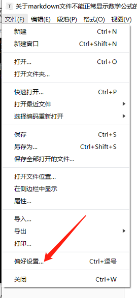
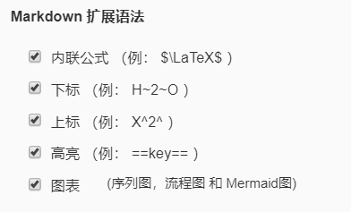

## Typora编辑器不能正常显示解决方法

1. latex是markdown的扩展语法，必须要打开内联公式。首先，打开偏好设置。

2.  选择内联公式

3.  然后重启Typora

## google浏览器不能正常显示

下载相应插件：

<https://chrome.google.com/webstore/detail/tex-all-the-things/cbimabofgmfdkicghcadidpemeenbffn>

[参考链接]([https://yujunjiex.gitee.io/2018/08/16/%E7%BD%91%E9%A1%B5%E4%B8%8A%E6%95%B0%E5%AD%A6%E5%85%AC%E5%BC%8F%E6%98%BE%E7%A4%BA%E4%B8%8D%E6%AD%A3%E7%A1%AE%E7%9A%84%E8%A7%A3%E5%86%B3%E6%96%B9%E6%A1%88/](https://yujunjiex.gitee.io/2018/08/16/网页上数学公式显示不正确的解决方案/))